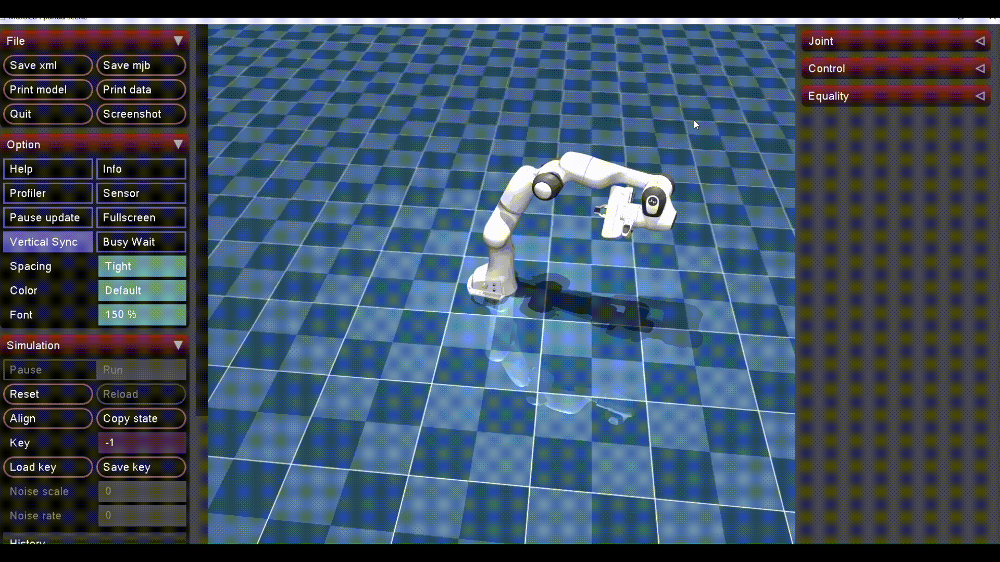
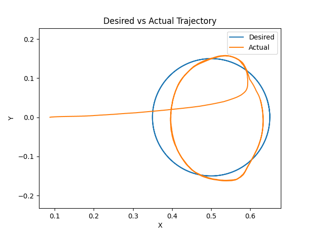
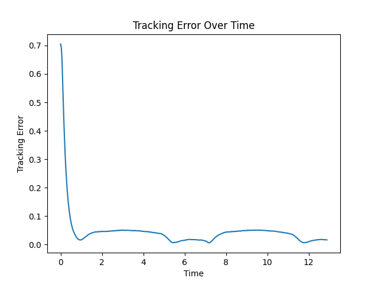

# End-Effector Tracking using Cartesian PD Control and Reinforcement Learning

## About

Hi! This project implements a trajectory-tracking controller for a simulated Franka Panda robotic arm in MuJoCo. The objective is to achieve accurate and smooth end-effector tracking of a desired Cartesian trajectory over time.

This approach combines a classical Cartesian PD controller with a residual reinforcement learning policy trained using PPO (Proximal Policy Optimisation). The reinforcement learning policy learns corrective torque actions that improve tracking behaviour under noisy conditions.

## Installation

Install required packages:

```bash
pip install mujoco stable-baselines3 gymnasium matplotlib numpy
```

---

## Running the Project

Train the reinforcement learning policy:

```bash
python train.py
```

This generates:

```text
franka_policy.zip
```

Evaluate the trained controller:

```bash
python main.py
```

Evaluation launches:

* MuJoCo simulation
* Desired vs actual trajectory plots
* Tracking error plots
* Tracking performance statistics

---
## State, Action, Reward Design

- State: PPO receives the end-effector position, velocity and Cartesian tracking error:

  `[x, y, z, ẋ, ẏ, ż, xerror, yerror, zerror]`

- Action: PPO outputs seven residual joint torque corrections which are combined with the baseline controller:

  Final Torque = PD Torque + RL Correction

- Reward: The reward minimises tracking error while penalising large corrective actions:

   Reward = -Tracking Error - 0.001(Action²)

## How the trajectory is represented 

The desired trajectory is represented as a circular Cartesian path generated using sinusoidal functions over time.

## How tracking performance is evaluated

Performance is evaluated using mean tracking error, maximum tracking error and desired-vs-actual trajectory/error plots. Gaussian noise (noise_std = 0.01) is added during training to assess robustness under sensor uncertainty.

Example results:

- Mean tracking error: 0.03160601387771082
- Max tracking error: 0.705209188822721
- The controller maintained stable tracking of the desired circular trajectory while keeping average error relatively low. Small deviations mainly occur during the initial settling phase and due to observation noise introduced during training.

### Simulation Results

| Simulation | Desired vs Actual Trajectory | Tracking Error |
|-------------|------------------------------|----------------|
|  |  |  |

Had a lot of fun building this project and applying concepts from my robotics modules, particularly control methods, robot kinematics and reinforcement learning 🤖
